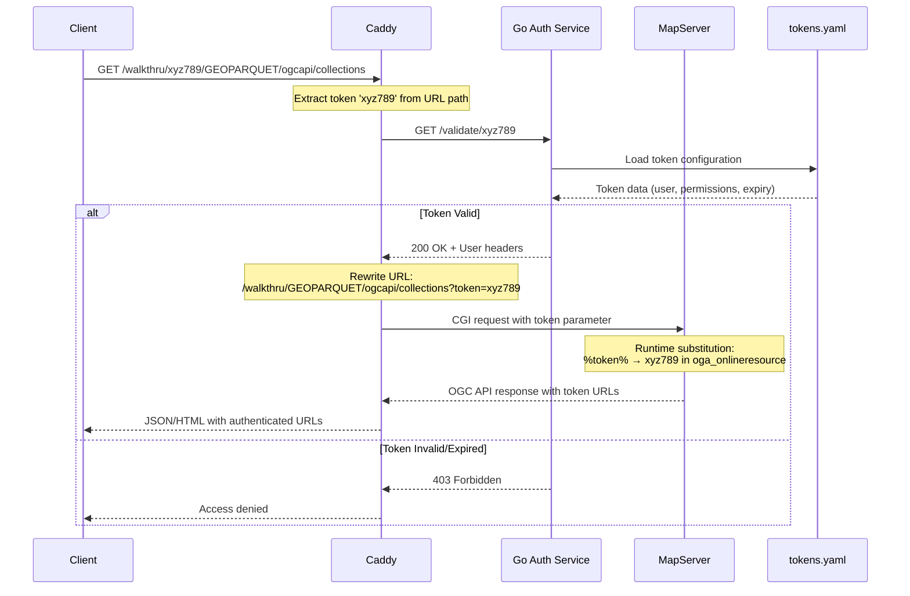
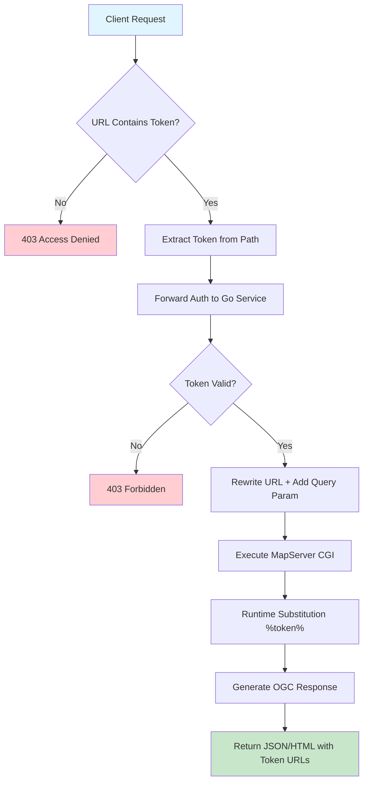

# MapServer Token-Based Authentication POC

## Overview

This document describes the token-based authentication mechanism implemented for MapServer OGC API services using Caddy as a reverse proxy. The solution provides secure access to MapServer endpoints while maintaining OGC standards compliance.

This authentication system was built on top of the existing **MapServer GeoParquet Demo** project, which serves GeoParquet files via MapServer with OGC API Features, WFS, and MVT tiles using Caddy with CGI support.

## Architecture

The authentication system consists of three main components:

1. **Caddy Web Server** - Handles token extraction, validation, and URL rewriting
2. **Go Authentication Service** - Validates tokens against a YAML configuration
3. **MapServer** - Serves OGC API content with token-aware URLs

## Authentication Flow



## URL Structure

### Input URL (Client Request)
```
http://localhost:8080/walkthru/{TOKEN}/GEOPARQUET/ogcapi/collections
```

### Internal Processing
```
1. Extract token: xyz789
2. Validate: /validate/xyz789
3. Rewrite: /walkthru/GEOPARQUET/ogcapi/collections?token=xyz789
4. Process: MapServer CGI execution
5. Substitute: %token% → xyz789 in responses
```

### Output URLs (MapServer Response)
```json
{
  "links": [
    {
      "href": "http://localhost:8080/walkthru/xyz789/GEOPARQUET/ogcapi/collections?f=json",
      "rel": "self"
    }
  ]
}
```

## Component Details

### 1. Caddy Configuration

```caddyfile
# Extract token from path using regex
@walkthru_with_token path_regexp token ^/walkthru/([^/]+)(.*)$

handle @walkthru_with_token {
    # Forward authentication
    forward_auth localhost:9000 {
        uri /validate/{re.token.1}
    }

    # Rewrite URL to include token as query parameter
    rewrite /walkthru{re.token.2}?token={re.token.1}&{query}

    # CGI execution
    cgi /walkthru* mapserv {
        script_name /walkthru
        dir .
        env MAPSERVER_CONFIG_FILE=./mapserver.conf
    }
}
```

### 2. Token Validation Service (Modern Go 1.22+ HTTP Router)

```go
func validateToken(w http.ResponseWriter, r *http.Request) {
    // Extract token using native Go 1.22+ path values
    token := r.PathValue("token")

    config, _ := loadTokens()
    tokenInfo, exists := config.Tokens[token]

    if !exists {
        http.Error(w, "Invalid token", http.StatusForbidden)
        return
    }

    // Check expiration
    expires, _ := time.Parse("2006-01-02", tokenInfo.Expires)
    if time.Now().After(expires) {
        http.Error(w, "Token expired", http.StatusForbidden)
        return
    }

    w.Header().Set("X-Validated-User", tokenInfo.User)
    json.NewEncoder(w).Encode(tokenInfo)
}

func main() {
    // Native Go HTTP routing with method and path patterns
    http.HandleFunc("GET /validate/{token}", validateToken)
    log.Fatal(http.ListenAndServe(":9000", nil))
}
```

**Modern Go Features Used:**
- ✅ **Native HTTP routing** (Go 1.22+) - No external dependencies
- ✅ **Method-specific patterns** - `"GET /validate/{token}"`
- ✅ **Path parameter extraction** - `r.PathValue("token")`
- ✅ **Better performance** - Optimized standard library implementation
```

### 3. MapServer Configuration

**mapserver.conf**
```
CONFIG
  ENV
    MS_MAP_PATTERN "^.*maps/.*\\.map$"
  END
  MAPS
    GEOPARQUET "./maps/geoparquet.map"
  END
END
```

**geoparquet.map**
```mapfile
WEB
  METADATA
    # OGC API responses (JSON/HTML)
    "oga_onlineresource" "http://localhost:8080/walkthru/%token%/GEOPARQUET/ogcapi"

    # WFS XML responses (GetCapabilities, DescribeFeatureType, etc.)
    "wfs_onlineresource" "http://localhost:8080/walkthru/%token%/?map=GEOPARQUET&"

    # General OWS services fallback (WMS, other XML services)
    "ows_onlineresource" "http://localhost:8080/walkthru/%token%/?map=GEOPARQUET&"
  END

  VALIDATION
    "token" "^[a-zA-Z0-9_-]+$"
    "default_token" "default"
  END
END
```

## Token Management

### Token Configuration (tokens.yaml)

```yaml
tokens:
  abc123:
    user: "user1"
    permissions: ["read", "write"]
    expires: "2025-12-31"
  def456:
    user: "user2"
    permissions: ["read"]
    expires: "2025-06-30"
  xyz789:
    user: "admin"
    permissions: ["read", "write", "admin"]
    expires: "2026-01-01"
```

### Token Properties

- **Token ID**: Alphanumeric identifier (abc123, def456, xyz789)
- **User**: Associated username
- **Permissions**: Array of allowed operations
- **Expires**: Expiration date (YYYY-MM-DD format)

## Data Flow Diagram



## Security Features

### 1. Path-Based Token Extraction
- Tokens are embedded in URL paths: `/walkthru/{token}/...`
- Compatible with OGC standards and ArcGIS Pro
- No query parameter limitations

### 2. External Token Validation
- Centralized token management via YAML file
- Expiration date checking
- User and permission tracking
- No restart required for token updates

### 3. MapServer Security
- `MS_MAP_PATTERN` restricts file access
- Runtime substitution with validation
- Secure mapfile location

### 4. URL Rewriting
- Transparent token handling
- Maintains OGC API compliance
- Automatic token injection in responses

## Benefits

1. **OGC Compliance**: Works with standard OGC clients
2. **ArcGIS Pro Compatible**: No custom authentication headers required
3. **Dynamic URLs**: All response links include valid tokens
4. **Centralized Management**: YAML-based token configuration
5. **Security**: Multi-layer validation and access control
6. **Scalable**: Easy to add new tokens and users
7. **Modern Go**: Uses native HTTP router (Go 1.22+) - no external dependencies
8. **High Performance**: Optimized standard library implementation
9. **Minimal Dependencies**: Only requires `gopkg.in/yaml.v3`

## Technical Advantages

### Native Go HTTP Router (Go 1.22+)
- **Zero external dependencies** for HTTP routing
- **Built-in path parameter extraction** with `r.PathValue()`
- **Method-specific routing** patterns like `"GET /validate/{token}"`
- **Better performance** than third-party routers
- **Future-proof** using standard library features
- **Smaller binary size** with fewer dependencies

## Key Learnings from the Authentication Journey

### 1. MapServer Service Architecture Understanding

**Discovery**: MapServer has three distinct service types, each with different URL generation mechanisms:

- **OGC API** (JSON/HTML): Uses `oga_onlineresource` for RESTful endpoints
- **WFS/WMS** (XML): Uses `wfs_onlineresource`/`wms_onlineresource` for traditional OGC services
- **General OWS**: Uses `ows_onlineresource` as fallback for XML services

**Solution**: Configure all three online resource types to ensure complete token coverage:
```mapfile
"oga_onlineresource" "http://localhost:8080/walkthru/%token%/GEOPARQUET/ogcapi"
"wfs_onlineresource" "http://localhost:8080/walkthru/%token%/?map=GEOPARQUET&"
"ows_onlineresource" "http://localhost:8080/walkthru/%token%/?map=GEOPARQUET&"
```

### 2. Runtime Substitution vs Environment Variables

**Initial Approach**: Tried using environment variables (`%MS_MAPFILE_PATTERN%`) but encountered CONFIG file access issues.

**Working Solution**: Use MapServer's runtime substitution with URL parameters:
- Extract token from URL path in Caddy
- Pass token as query parameter to MapServer
- Use `%token%` substitution in online resource URLs
- Require `VALIDATION` block for security

### 3. URL Structure Consistency

**Challenge**: Different services require different URL patterns:
- **OGC API**: `/walkthru/{token}/GEOPARQUET/ogcapi/collections`
- **WFS**: `/walkthru/{token}/?MAP=GEOPARQUET&SERVICE=WFS&REQUEST=GetCapabilities`

**Solution**: Caddy URL rewriting handles both patterns transparently:
```caddyfile
rewrite /walkthru{re.token.2}?token={re.token.1}&{query}
```

### 4. Authentication Flow Architecture

**Key Components**:
1. **Path-based token extraction** - Compatible with OGC standards
2. **External validation service** - Centralized token management
3. **URL rewriting** - Transparent token handling
4. **Runtime substitution** - Dynamic URL generation

**Flow**: `Client → Caddy (extract token) → Auth Service (validate) → Caddy (rewrite URL) → MapServer (substitute %token%)`

### 5. OGC Standards Compatibility

**Critical Discovery**: OGC clients (like ArcGIS Pro) cannot handle:
- Custom authentication headers
- Non-standard query parameters in base URLs
- Complex authentication schemes

**Solution**: Path-based tokens embedded in URLs work universally:
- Compatible with all OGC clients
- Follows RESTful principles
- No authentication header requirements

### 6. Modern Go Development

**Evolution**: Migrated from `gorilla/mux` to native Go 1.22+ HTTP router:
- Eliminated external dependencies
- Improved performance
- Simplified codebase
- Used modern Go features like `r.PathValue()`

### 7. Configuration File Hierarchy

**Understanding**: MapServer 8.0+ CONFIG file structure:
- `ENV` section for environment variables
- `MAPS` section for mapfile aliases
- Relative paths work better than absolute paths
- Security through `MS_MAP_PATTERN` validation

### 8. Service Response Consistency

**Challenge**: Ensuring all service responses (JSON, HTML, XML) include correct token URLs.

**Solution**: Configure appropriate online resource for each service type:
- **JSON responses**: Use `oga_onlineresource`
- **XML responses**: Use `wfs_onlineresource` and `ows_onlineresource`
- **All responses**: Include token through runtime substitution

### 9. Security Best Practices

**Validation Requirements**:
- All runtime substitution requires `VALIDATION` blocks
- Token pattern validation: `"^[a-zA-Z0-9_-]+$"`
- External token validation with expiration checking
- Multi-layer security (Caddy + Auth Service + MapServer)

### 10. Debugging and Testing

**Essential Tools**:
- Test both JSON and XML endpoints
- Verify token inclusion in all response URLs
- Check different service types (OGC API, WFS, WMS)
- Validate authentication rejection for invalid tokens

**Example Test URLs**:
```bash
# OGC API (JSON)
curl "http://localhost:8080/walkthru/xyz789/GEOPARQUET/ogcapi/collections"

# WFS (XML)
curl "http://localhost:8080/walkthru/abc123/?MAP=GEOPARQUET&SERVICE=WFS&REQUEST=GetCapabilities"
```

This authentication journey revealed the complexity of MapServer's service architecture while demonstrating how modern web technologies (Caddy, Go 1.22+) can create elegant, standards-compliant solutions for geospatial service security.

## Usage Examples

### Valid Requests
```bash
# Collections endpoint
curl "http://localhost:8080/walkthru/xyz789/GEOPARQUET/ogcapi/collections"

# Items endpoint
curl "http://localhost:8080/walkthru/abc123/GEOPARQUET/ogcapi/collections/countries/items"

# HTML format
curl "http://localhost:8080/walkthru/def456/GEOPARQUET/ogcapi/collections?f=html"
```

### Invalid Requests
```bash
# No token
curl "http://localhost:8080/walkthru/GEOPARQUET/ogcapi/collections"
# Returns: 403 Access denied - token required

# Invalid token
curl "http://localhost:8080/walkthru/invalid123/GEOPARQUET/ogcapi/collections"
# Returns: 403 Invalid token

# Expired token (if configured)
curl "http://localhost:8080/walkthru/expired456/GEOPARQUET/ogcapi/collections"
# Returns: 403 Token expired
```

## Project Structure

```
mapserver-parquet/
├── pixi.toml              # Pixi project configuration & tasks
├── Caddyfile              # Caddy web server configuration with auth
├── caddy                  # Custom-built Caddy binary with CGI
├── mapserver.conf         # MapServer main configuration
├── maps/                  # MapServer map definitions
│   ├── geoparquet.map     # Remote GeoParquet via /vsicurl/
│   └── duckdb.map         # Local Parquet via DuckDB/ADBC
├── auth/                  # Authentication service
│   ├── auth_server.go     # Go-based token validation server (native HTTP router)
│   ├── go.mod             # Go module dependencies (minimal - only YAML)
│   ├── go.sum             # Go module checksums
│   └── tokens.yaml        # Token configuration file
├── data/                  # Local data files
└── templates/             # HTML templates for OGC API
```

## Deployment

### Option 1: Manual Setup

1. **Start Authentication Service**:
   ```bash
   cd auth && go run auth_server.go
   ```

2. **Start Caddy** (in separate terminal):
   ```bash
   pixi run serve
   ```

### Option 2: Using Pixi Tasks

1. **Start Authentication Service**:
   ```bash
   pixi run auth-server
   ```

2. **Start Caddy** (in separate terminal):
   ```bash
   pixi run serve
   ```

### Configuration

3. **Configure Tokens**: Edit `auth/tokens.yaml` as needed

4. **Test Access**: Use valid tokens in URL paths

## Complete Setup from Scratch

```bash
# Clone or setup the project
git clone <your-repo>
cd mapserver-parquet

# Install dependencies
pixi install

# Build Caddy with CGI support
pixi run build-caddy

# Start auth server (Terminal 1)
pixi run auth-server

# Start Caddy server (Terminal 2)
pixi run serve

# Test authenticated endpoint
curl "http://localhost:8080/walkthru/xyz789/GEOPARQUET/ogcapi/collections"
```

## Token Management

Edit `auth/tokens.yaml` to manage users and permissions:

```yaml
tokens:
  abc123:
    user: "user1"
    permissions: ["read", "write"]
    expires: "2025-12-31"
  def456:
    user: "user2"
    permissions: ["read"]
    expires: "2025-06-30"
  xyz789:
    user: "admin"
    permissions: ["read", "write", "admin"]
    expires: "2026-01-01"
```

This authentication mechanism provides a robust, standards-compliant solution for securing MapServer OGC API endpoints while maintaining compatibility with GIS clients and OGC standards.