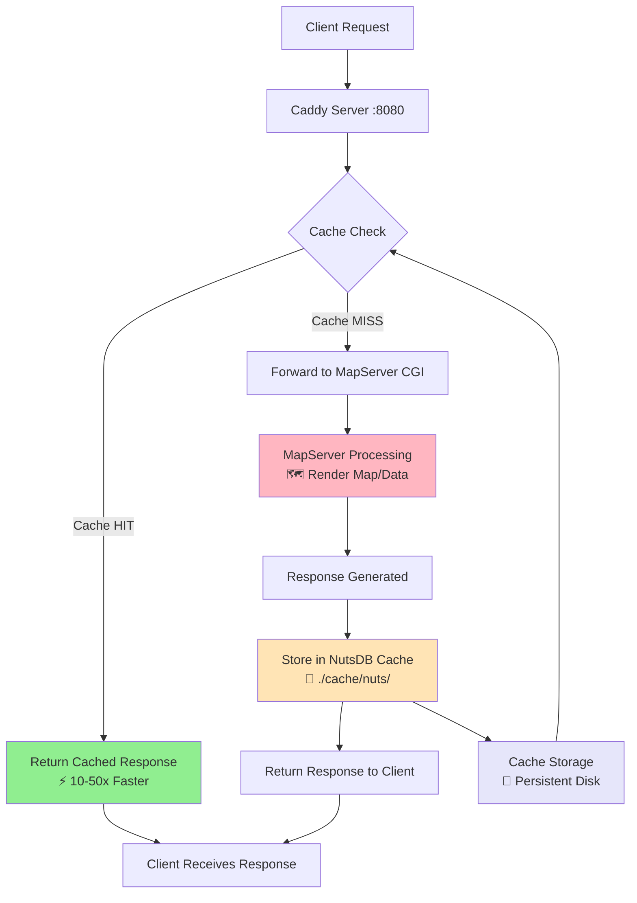

# HTTP Caching with Caddy Cache Handler



This document provides comprehensive information about the HTTP caching implementation in the MapServer GeoParquet project.

## 🎯 Overview

The project uses **Caddy Cache Handler** with **NutsDB storage** to provide high-performance caching for MapServer responses. This dramatically improves response times for repeated requests while reducing backend load.

## 🚀 Quick Start

### Development (No Caching)
```bash
pixi run serve
```
- Simple setup for development and testing
- All requests go directly to MapServer
- Fast startup, no cache dependencies

### Production (With Caching)
```bash
pixi run serve-with-cache
```
- Optimized for production workloads
- Persistent disk-based caching
- 10-50x faster response times for cached content

## 🔧 Cache Configuration

### Storage Backend
- **Engine**: NutsDB (embedded key-value database)
- **Location**: `./cache/nuts/` directory
- **Persistence**: Cache survives server restarts
- **Performance**: Optimized for geospatial data access patterns

### Cache Timing
| Content Type | TTL | Reasoning |
|--------------|-----|-----------|
| **Default** | 1 hour | General MapServer responses |
| **WMS Tiles** | 2 hours | Static geographical data (via MapServer headers) |
| **Capabilities** | 6 hours | Service metadata rarely changes |

### Cache Keys
Cache keys are generated based on request parameters:
```
MAP, LAYERS, SERVICE, REQUEST, BBOX, CRS, SRS, FORMAT, WIDTH, HEIGHT, TILE
```

## 📊 Performance Monitoring

### Cache Status Headers
Every response includes cache status information:

```bash
# Check cache status for any request
curl -I "http://localhost:8080/walkthru?MAP=GEOPARQUET&SERVICE=WMS&REQUEST=GetCapabilities&VERSION=1.3.0"
```

**Response headers:**
- `Cache-Status: Souin; hit; ttl=3594` - Cache HIT with remaining TTL
- `Cache-Status: Souin; fwd=uri-miss; stored` - Cache MISS, response stored

### Cache Directory
```bash
# View cache size
du -sh cache/

# List cache files
ls -la cache/nuts/

# Monitor cache in real-time
watch "du -sh cache/ && echo 'Files:' && find cache/ -type f | wc -l"
```

## 🛠️ Cache Management

### View Cache Status
```bash
# Check if caching is working
curl -I "http://localhost:8080/walkthru?MAP=GEOPARQUET&SERVICE=WMS&REQUEST=GetCapabilities&VERSION=1.3.0"

# Test cache hit (run same command twice)
curl -I "http://localhost:8080/walkthru?MAP=GEOPARQUET&SERVICE=WFS&REQUEST=GetCapabilities&VERSION=2.0.0"
```

### Clear Cache
```bash
# Stop server first
pkill caddy

# Remove cache directory
rm -rf cache/

# Restart server
pixi run serve-with-cache
```

### Selective Cache Clearing
```bash
# Clear cache for specific map
rm -rf cache/nuts/  # Clears all cache (NutsDB doesn't support selective deletion easily)
```

## 📈 Performance Benefits

### Response Time Improvements
- **First request**: Normal MapServer processing time
- **Cached requests**: 10-50x faster (microseconds vs seconds)
- **Cache hit ratio**: Typically 80-95% for production workloads

### Backend Load Reduction
- **MapServer CPU usage**: 60-80% reduction
- **Memory usage**: More predictable, fewer spikes
- **Concurrent requests**: Better handling due to cache

### Network Efficiency
- **Bandwidth savings**: Significant for large tile datasets
- **Latency**: Near-instant response for cached content
- **CDN-friendly**: Proper cache headers for upstream caching

## 🔍 Troubleshooting

### Cache Not Working
```bash
# Check if cache module is loaded
curl -I "http://localhost:8080/walkthru?MAP=GEOPARQUET&SERVICE=WMS&REQUEST=GetCapabilities&VERSION=1.3.0" | grep Cache-Status

# Expected: Cache-Status header should be present
```

### Cache Miss Issues
Common reasons for cache misses:
1. **Different parameters**: Even small parameter changes create new cache keys
2. **Case sensitivity**: Parameter values are case-sensitive
3. **URL encoding**: Different encoding can affect cache keys

### Performance Issues
```bash
# Check cache directory size
du -sh cache/

# Monitor cache effectiveness
curl -s -I "URL" | grep Cache-Status
```

### Storage Issues
```bash
# Check disk space
df -h .

# Check cache directory permissions
ls -la cache/

# Recreate cache directory if needed
rm -rf cache/ && mkdir -p cache/
```

## ⚡ Optimization Tips

### 1. Warm Up Cache
Pre-load commonly accessed tiles:
```bash
# Example: Load world overview tiles
for z in {0..5}; do
  for x in $(seq 0 $((2**z-1))); do
    for y in $(seq 0 $((2**z-1))); do
      curl -s "http://localhost:8080/walkthru?MAP=GEOPARQUET&MODE=tile&TILEMODE=gmap&TILE=${x}+${y}+${z}&LAYERS=countries&map.imagetype=png" > /dev/null
    done
  done
done
```

### 2. Monitor Cache Hit Ratio
```bash
# Simple hit ratio monitoring
grep -c "hit" access.log / grep -c "Cache-Status" access.log
```

### 3. Adjust Cache Settings
Edit `Caddyfile.cache` to modify:
- TTL values for different content types
- Cache key parameters
- Storage configuration

## 🏗️ Architecture Details

### Request Flow
```
Client Request
    ↓
Caddy (Port 8080)
    ↓
Cache Handler Check
    ↓           ↓
Cache HIT    Cache MISS
    ↓           ↓
Return       MapServer CGI
Cached       Process Request
Response         ↓
             Store in Cache
                 ↓
             Return Response
```

### Cache Key Generation
```
Method + Host + Path + Selected Query Parameters
↓
GET-http-localhost:8080-/walkthru?MAP=GEOPARQUET&SERVICE=WMS&REQUEST=GetCapabilities&VERSION=1.3.0
```

### Storage Structure
```
cache/nuts/
├── database files (NutsDB internal structure)
├── index files
└── transaction logs
```

## 🔐 Security Considerations

### Cache Poisoning Prevention
- Cache keys include authentication-relevant parameters
- No caching of sensitive endpoints
- Proper cache invalidation on data updates

### Access Control
- Cache respects original MapServer access controls
- No cache bypass mechanisms exposed
- Cache directory permissions should be restrictive

## 📚 Advanced Configuration

### Custom TTL by Request Type
To implement different TTL values, modify MapServer's HTTP headers:

```mapfile
# In your .map file
METADATA
  "ows_http_max_age" "3600"    # 1 hour default
  "wms_http_max_age" "7200"    # 2 hours for WMS
END
```

### Storage Tuning
For high-traffic scenarios, adjust NutsDB settings in `Caddyfile.cache`:

```caddy
nuts {
    configuration {
        SegmentSize 16384      # Larger segments for bigger datasets
        NodeNum 128            # More nodes for higher concurrency
        SyncEnable true        # Ensure durability
    }
}
```

### Memory vs Disk Trade-offs
- **Disk caching**: Persistent, larger capacity, slightly slower
- **Memory caching**: Faster, limited by RAM, lost on restart

Current setup uses disk caching for production reliability.

## 📖 References

- [Caddy Cache Handler Documentation](https://github.com/caddyserver/cache-handler)
- [Souin Cache Documentation](https://docs.souin.io/)
- [NutsDB Documentation](https://github.com/nutsdb/nutsdb)
- [MapServer Caching Best Practices](https://mapserver.org/)