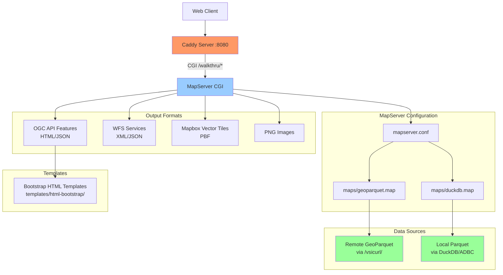

# MapServer GeoParquet Demo

A complete demonstration of serving GeoParquet files via MapServer with OGC API Features, WFS, and MVT tiles using Caddy as a web server.

## 🚀 Quick Start

```bash
# Install pixi environment
pixi install

#Install xcaddy and Build Caddy with CGI support
pixi run build-caddy

# Start the server
pixi run serve

# Test the endpoints
curl "http://localhost:8080/walkthru/GEOPARQUET/ogcapi/?f=json"
```

## 📋 Prerequisites

### Install Pixi Package Manager

**macOS/Linux:**
```bash
curl -fsSL https://pixi.sh/install.sh | sh
```

**Windows:**
- Download MSI: https://github.com/prefix-dev/pixi/releases/latest/download/pixi-x86_64-pc-windows-msvc.msi
- Or use PowerShell:
```powershell
powershell -ExecutionPolicy ByPass -c "irm -useb https://pixi.sh/install.ps1 | iex"
```

### Other Requirements
- Git (for template downloads)

## 🏗️ Architecture



## 📁 Project Structure

```
mapserver-parquet/
├── pixi.toml              # Pixi project configuration & tasks
├── Caddyfile              # Caddy web server configuration
├── caddy                  # Custom-built Caddy binary with CGI
├── mapserver.conf         # MapServer main configuration
├── maps/                  # MapServer map definitions
│   ├── geoparquet.map     # Remote GeoParquet via /vsicurl/
│   └── duckdb.map         # Local Parquet via DuckDB/ADBC
├── data/                  # Local data files
│   └── example.parquet    # Sample GeoParquet file
└── templates/             # HTML templates for OGC API
    └── html-bootstrap/    # Bootstrap-styled templates
```

## 🎯 Available Services

### Two Data Sources

1. **GEOPARQUET**: Local or Remote file via GDAL virtual_file_systems ... for more info : https://gdal.org/en/stable/user/virtual_file_systems.html
2. **DUCKDB**: Local or Remote file via DuckDB with ADBC driver over GDAL/OGR httpfs,parquet,spatial...etc DuckDB Extentions ... for more info : https://github.com/OSGeo/gdal/issues/10887 , https://duckdb.org/docs/stable/core_extensions/spatial/overview.html


### Service Endpoints

| Service | URL Pattern | Description |
|---------|-------------|-------------|
| **OGC API Features** | `/walkthru/{MAP}/ogcapi/{path}` | RESTful JSON/HTML API |
| **WFS** | `/walkthru?MAP={MAP}&SERVICE=WFS&REQUEST={request}` | OGC Web Feature Service |
| **MVT Tiles** | `/walkthru?MAP={MAP}&MODE=tile&TILE={x}+{y}+{z}&LAYERS={layer}&map.imagetype=mvt` | Vector tiles |
| **PNG Images** | `/walkthru?MAP={MAP}&LAYERS={layer}&map.imagetype=png` | Raster images |

### Example URLs

```bash
# OGC API Landing Pages
http://localhost:8080/walkthru/GEOPARQUET/ogcapi/
http://localhost:8080/walkthru/DUCKDB/ogcapi/

# Collections
http://localhost:8080/walkthru/GEOPARQUET/ogcapi/collections
http://localhost:8080/walkthru/DUCKDB/ogcapi/collections

# Feature Items
http://localhost:8080/walkthru/GEOPARQUET/ogcapi/collections/countries/items
http://localhost:8080/walkthru/DUCKDB/ogcapi/collections/countries/items

# WFS GetCapabilities
http://localhost:8080/walkthru?MAP=GEOPARQUET&SERVICE=WFS&REQUEST=GetCapabilities&VERSION=2.0.0
http://localhost:8080/walkthru?MAP=DUCKDB&SERVICE=WFS&REQUEST=GetCapabilities&VERSION=2.0.0

# MVT Tiles (for web maps - replace {x}, {y}, {z} with actual tile coordinates)
http://localhost:8080/walkthru?MAP=GEOPARQUET&MODE=tile&TILE={x}+{y}+{z}&LAYERS=countries&map.imagetype=mvt
```

## 🛠️ Pixi Tasks

| Task | Description |
|------|-------------|
| `pixi run install-xcaddy` | Install xcaddy tool |
| `pixi run build-caddy` | Build Caddy with CGI plugin (includes install-xcaddy) |
| `pixi run serve` | Start the server |

## 🔧 Configuration Details

### MapServer Features

- **GDAL/OGR**: Direct GeoParquet reading via `/vsicurl/`
- **DuckDB/ADBC**: High-performance local Parquet queries
- **Multiple Output Formats**: JSON, MVT, PNG, HTML
- **OGC Standards**: WFS 2.0.0, OGC API Features 1.0
- **Bootstrap UI**: Professional HTML interface

### Key Dependencies

- **MapServer** 8.4.1+ with OGC API support
- **GDAL** 3.11.4+ with Parquet/Arrow support
- **DuckDB** integration via ADBC
- **Go** 1.25.1+ for building custom Caddy
- **Caddy** with CGI plugin for web serving (https://github.com/aksdb/caddy-cgi)

## 🚦 Development

```bash
# Check environment
pixi info

# Rebuild Caddy if needed
pixi run build-caddy

# Start development server
pixi run serve
```

## 📝 Notes

- Templates provide HTML outputs for OGC API
- DuckDB configuration enables spatial functions
- Caddy serves static files from `./maps` directory and handles CGI routing