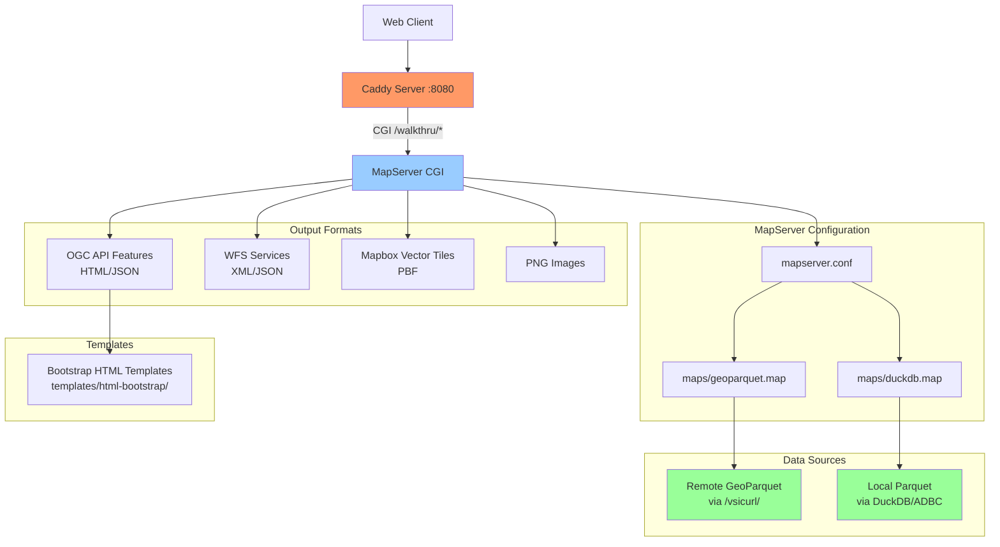

# MapServer GeoParquet Demo

A complete demonstration of serving GeoParquet files via MapServer with OGC API Features, WFS, and MVT tiles using Caddy as a web server.

## 🚀 Quick Start

```bash
# Install pixi environment
pixi install 

# Activate the Encironment 
pixi shell

#Install xcaddy and Build Caddy with CGI support
pixi run build-caddy

# Start the server
pixi run serve

# Test the endpoints
curl "http://localhost:8080/walkthru/GEOPARQUET/ogcapi/?f=json"
```

## 📋 Prerequisites

### Install Pixi Package Manager

**macOS/Linux:**
```bash
curl -fsSL https://pixi.sh/install.sh | sh
```

**Windows:**
- Download MSI: https://github.com/prefix-dev/pixi/releases/latest/download/pixi-x86_64-pc-windows-msvc.msi
- Or use PowerShell:
```powershell
powershell -ExecutionPolicy ByPass -c "irm -useb https://pixi.sh/install.ps1 | iex"
```

### Other Requirements
- Git (for template downloads)

## 🏗️ Architecture



## 📁 Project Structure

```
mapserver-parquet/
├── pixi.toml              # Pixi project configuration & tasks
├── Caddyfile              # Caddy web server configuration
├── caddy                  # Custom-built Caddy binary with CGI
├── mapserver.conf         # MapServer main configuration
├── maps/                  # MapServer map definitions
│   ├── geoparquet.map     # Remote GeoParquet via /vsicurl/
│   └── duckdb.map         # Local Parquet via DuckDB/ADBC
├── data/                  # Local data files
│   └── example.parquet    # Sample GeoParquet file
└── templates/             # HTML templates for OGC API
    └── html-bootstrap/    # Bootstrap-styled templates
```

## 🎯 Available Services

### Two Data Sources

1. **GEOPARQUET**: Local or Remote file via GDAL virtual_file_systems ... for more info : https://gdal.org/en/stable/user/virtual_file_systems.html
2. **DUCKDB**: Local or Remote file via DuckDB with ADBC driver over GDAL/OGR httpfs,parquet,spatial...etc DuckDB Extentions ... for more info : https://github.com/OSGeo/gdal/issues/10887 , https://duckdb.org/docs/stable/core_extensions/spatial/overview.html


### Service Endpoints

| Service | URL Pattern | Description |
|---------|-------------|-------------|
| **OGC API Features** | `/walkthru/{MAP}/ogcapi/{path}` | RESTful JSON/HTML API |
| **WFS** | `/walkthru?MAP={MAP}&SERVICE=WFS&REQUEST={request}` | OGC Web Feature Service |
| **WMS** | `/walkthru?MAP={MAP}&SERVICE=WMS&REQUEST={request}` | OGC Web Map Service |
| **MVT Tiles** | `/walkthru?MAP={MAP}&MODE=tile&TILE={x}+{y}+{z}&LAYERS={layer}&map.imagetype=mvt` | Vector tiles |
| **PNG Tiles** | `/walkthru?MAP={MAP}&MODE=tile&TILEMODE=gmap&TILE={x}+{y}+{z}&LAYERS={layer}&map.imagetype=png` | Raster tiles (XYZ) |
| **PNG Images** | `/walkthru?MAP={MAP}&LAYERS={layer}&map.imagetype=png` | Raster images |

### Example URLs

```bash
# OGC API Features Complete Endpoints
http://localhost:8080/walkthru/GEOPARQUET/ogcapi/                                    # Landing page
http://localhost:8080/walkthru/GEOPARQUET/ogcapi/conformance                        # Conformance classes
http://localhost:8080/walkthru/GEOPARQUET/ogcapi/collections                        # Collections list
http://localhost:8080/walkthru/GEOPARQUET/ogcapi/collections/countries              # Collection metadata
http://localhost:8080/walkthru/GEOPARQUET/ogcapi/collections/countries/items       # Collection items
http://localhost:8080/walkthru/GEOPARQUET/ogcapi/collections/countries/items/{id}  # Individual item

# DuckDB endpoints (same pattern)
http://localhost:8080/walkthru/DUCKDB/ogcapi/
http://localhost:8080/walkthru/DUCKDB/ogcapi/collections/countries/items

# WFS Operations
http://localhost:8080/walkthru?MAP=GEOPARQUET&SERVICE=WFS&REQUEST=GetCapabilities&VERSION=2.0.0

# GetFeature - GeoJSON format (for web applications)
http://localhost:8080/walkthru?MAP=GEOPARQUET&SERVICE=WFS&REQUEST=GetFeature&VERSION=2.0.0&TYPENAME=countries&OUTPUTFORMAT=application/json; subtype=geojson; charset=utf-8&COUNT=10

# GetFeature - GML format (for GIS applications)
http://localhost:8080/walkthru?MAP=GEOPARQUET&SERVICE=WFS&REQUEST=GetFeature&VERSION=2.0.0&TYPENAME=countries&OUTPUTFORMAT=application/gml+xml; version=3.2&COUNT=10

# DescribeFeatureType
http://localhost:8080/walkthru?MAP=GEOPARQUET&SERVICE=WFS&REQUEST=DescribeFeatureType&VERSION=2.0.0&TYPENAME=countries

# WMS Operations
http://localhost:8080/walkthru?MAP=GEOPARQUET&SERVICE=WMS&REQUEST=GetCapabilities&VERSION=1.3.0
http://localhost:8080/walkthru?MAP=GEOPARQUET&SERVICE=WMS&REQUEST=GetMap&VERSION=1.3.0&LAYERS=countries&CRS=EPSG:4326&BBOX=-180,-90,180,90&WIDTH=800&HEIGHT=600&FORMAT=image/png
http://localhost:8080/walkthru?MAP=GEOPARQUET&SERVICE=WMS&REQUEST=GetFeatureInfo&VERSION=1.3.0&LAYERS=countries&CRS=EPSG:4326&BBOX=-180,-90,180,90&WIDTH=800&HEIGHT=600&FORMAT=image/png&QUERY_LAYERS=countries&I=400&J=300&INFO_FORMAT=text/html

# Tiles (for web maps - replace {x}, {y}, {z} with actual tile coordinates)
http://localhost:8080/walkthru?MAP=GEOPARQUET&MODE=tile&TILE={x}+{y}+{z}&LAYERS=countries&map.imagetype=mvt
http://localhost:8080/walkthru?MAP=GEOPARQUET&MODE=tile&TILEMODE=gmap&TILE={x}+{y}+{z}&LAYERS=countries&map.imagetype=png
```

## 📋 URL Parameters Reference

### Common Parameters
| Parameter | Description | Example | Required |
|-----------|-------------|---------|----------|
| `MAP` | Map configuration to use | `GEOPARQUET`, `DUCKDB` | ✅ |
| `SERVICE` | OGC service type | `WMS`, `WFS` | ✅ |
| `REQUEST` | Operation to perform | `GetCapabilities`, `GetMap` | ✅ |
| `VERSION` | Service version | `1.3.0`, `2.0.0` | ✅ |
| `LAYERS` | Layer name(s) | `countries` | ✅ |

### WMS-Specific Parameters
| Parameter | Description | Example | Required |
|-----------|-------------|---------|----------|
| `CRS`/`SRS` | Coordinate reference system | `EPSG:4326`, `EPSG:3857` | ✅ |
| `BBOX` | Bounding box | `-180,-90,180,90` | ✅ |
| `WIDTH` | Image width in pixels | `800` | ✅ |
| `HEIGHT` | Image height in pixels | `600` | ✅ |
| `FORMAT` | Output image format | `image/png`, `image/jpeg` | ✅ |
| `QUERY_LAYERS` | Layers to query | `countries` | GetFeatureInfo |
| `I` | X pixel coordinate | `400` | GetFeatureInfo |
| `J` | Y pixel coordinate | `300` | GetFeatureInfo |
| `INFO_FORMAT` | Info response format | `text/html`, `application/json` | GetFeatureInfo |

### WFS-Specific Parameters
| Parameter | Description | Example | Required | Tested |
|-----------|-------------|---------|----------|--------|
| `TYPENAME` | Feature type name | `countries` | ✅ | ✅ |
| `OUTPUTFORMAT` | Response format | `application/json; subtype=geojson; charset=utf-8` | ❌ | ✅ |
| `COUNT` | Maximum features returned | `2`, `5`, `10` | ❌ | ✅ |
| `STARTINDEX` | Starting feature index | `0`, `2`, `3` | ❌ | ✅ |
| `BBOX` | Spatial bounding box filter | `-180,-90,180,90` | ❌ | ✅ |

#### Supported WFS Output Formats
| Format Name | Use Case | Example |
|-------------|----------|---------|
| `application/gml+xml; version=3.2` | Standard GML (default) | Desktop GIS applications |
| `application/json; subtype=geojson; charset=utf-8` | GeoJSON for web apps | JavaScript/web mapping |
| `text/xml; subtype=gml/3.2.1` | Legacy GML | Older GIS software |

#### WFS Parameter Examples

**Basic Usage:**
```bash
# Get all 5 countries in GeoJSON format
curl "http://localhost:8080/walkthru?MAP=GEOPARQUET&SERVICE=WFS&REQUEST=GetFeature&VERSION=2.0.0&TYPENAME=countries&OUTPUTFORMAT=application/json; subtype=geojson; charset=utf-8"

# Limit to 2 features
curl "http://localhost:8080/walkthru?MAP=GEOPARQUET&SERVICE=WFS&REQUEST=GetFeature&VERSION=2.0.0&TYPENAME=countries&OUTPUTFORMAT=application/json; subtype=geojson; charset=utf-8&COUNT=2"

# Default GML format (no OUTPUTFORMAT specified)
curl "http://localhost:8080/walkthru?MAP=GEOPARQUET&SERVICE=WFS&REQUEST=GetFeature&VERSION=2.0.0&TYPENAME=countries&COUNT=1"
```

**Pagination Examples:**
```bash
# Skip first 2 countries, get next 2 (returns: Canada, United States of America)
curl "http://localhost:8080/walkthru?MAP=GEOPARQUET&SERVICE=WFS&REQUEST=GetFeature&VERSION=2.0.0&TYPENAME=countries&OUTPUTFORMAT=application/json; subtype=geojson; charset=utf-8&COUNT=2&STARTINDEX=2"

# Get countries 3-4 (0-based indexing)
curl "http://localhost:8080/walkthru?MAP=GEOPARQUET&SERVICE=WFS&REQUEST=GetFeature&VERSION=2.0.0&TYPENAME=countries&OUTPUTFORMAT=application/json; subtype=geojson; charset=utf-8&COUNT=2&STARTINDEX=3"
```

**Spatial Filtering Examples:**
```bash
# World extent (gets 4 of 5 countries - some geometries may have projection issues)
curl "http://localhost:8080/walkthru?MAP=GEOPARQUET&SERVICE=WFS&REQUEST=GetFeature&VERSION=2.0.0&TYPENAME=countries&OUTPUTFORMAT=application/json; subtype=geojson; charset=utf-8&BBOX=-180,-90,180,90"

# Note: The example dataset contains only 5 countries:
# - Canada, Fiji, Tanzania, United States of America, W. Sahara
# BBOX filtering works but requires precise coordinates matching country extents
```

### Tile Parameters
| Parameter | Description | Example | Required |
|-----------|-------------|---------|----------|
| `MODE` | Request mode | `tile` | ✅ |
| `TILEMODE` | Tiling scheme | `gmap` | PNG tiles |
| `TILE` | Tile coordinates | `{x}+{y}+{z}` | ✅ |
| `map.imagetype` | Output format | `mvt`, `png` | ✅ |

## 🛠️ Pixi Tasks

| Task | Description |
|------|-------------|
| `pixi run install-xcaddy` | Install xcaddy tool |
| `pixi run build-caddy` | Build Caddy with CGI and cache plugins |
| `pixi run serve` | Start the server (development mode) |
| `pixi run serve-with-cache` | Start the server with HTTP caching (production mode) |

## 🔧 Configuration Details

### MapServer Features

- **GDAL/OGR**: Direct GeoParquet reading via `/vsicurl/`
- **DuckDB/ADBC**: High-performance local Parquet queries
- **Multiple Output Formats**: JSON, MVT, PNG, HTML, WMS
- **OGC Standards**: WFS 2.0.0, WMS 1.3.0, OGC API Features 1.0
- **Bootstrap UI**: Professional HTML interface
- **HTTP Caching**: Automatic response caching via Caddy Cache Handler

### Key Dependencies

- **MapServer** 8.4.1+ with OGC API support
- **GDAL** 3.11.4+ with Parquet/Arrow support
- **DuckDB** integration via ADBC
- **Go** 1.25.1+ for building custom Caddy
- **Caddy** with CGI plugin for web serving (https://github.com/aksdb/caddy-cgi)
- **Caddy Cache Handler** for HTTP response caching (https://github.com/caddyserver/cache-handler)

## 🚦 Development

```bash
# Check environment
pixi info

# Rebuild Caddy if needed
pixi run build-caddy

# Start development server
pixi run serve
```

## 🚀 Performance Modes

### Development Mode
```bash
pixi run serve          # Simple setup, no caching
```

### Production Mode
```bash
pixi run serve-with-cache    # HTTP caching enabled
```

**Production mode features:**
- **Persistent disk caching** with NutsDB storage
- **1-hour default TTL** for MapServer responses
- **Intelligent cache keys** based on request parameters
- **10-50x faster** response times for repeated requests

For detailed caching information, see [CACHE.md](CACHE.md).

## 📝 Notes

- Templates provide HTML outputs for OGC API
- DuckDB configuration enables spatial functions
- Caddy serves static files from `./maps` directory and handles CGI routing
- HTTP caching dramatically improves performance for repeated requests